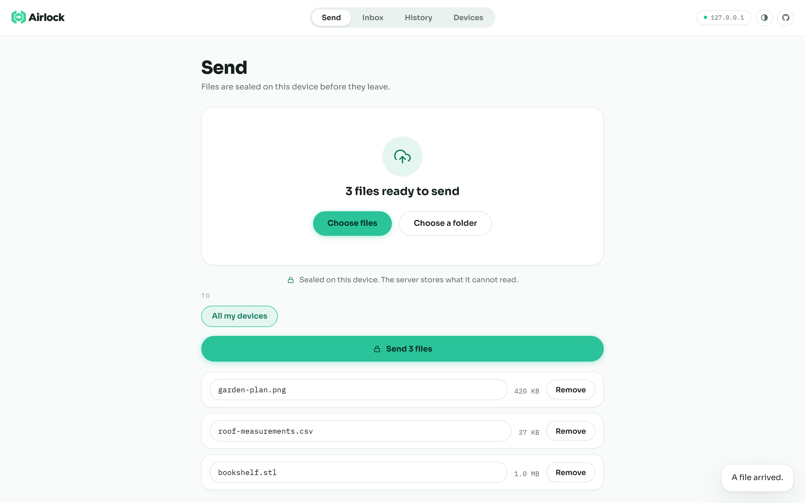
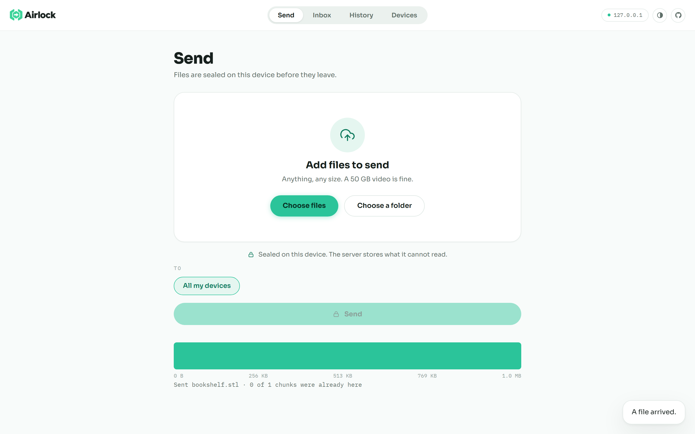
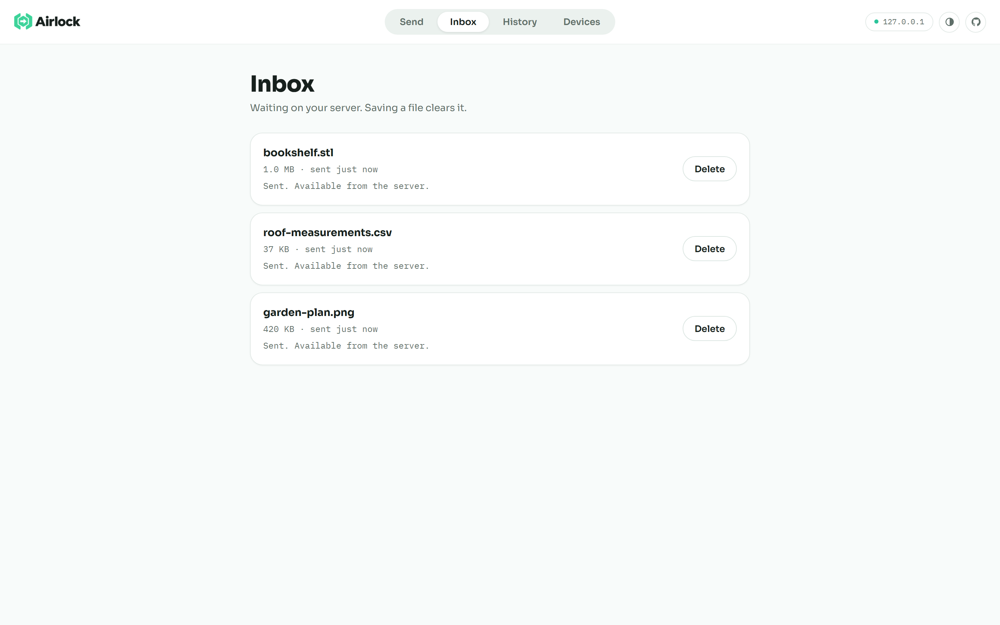
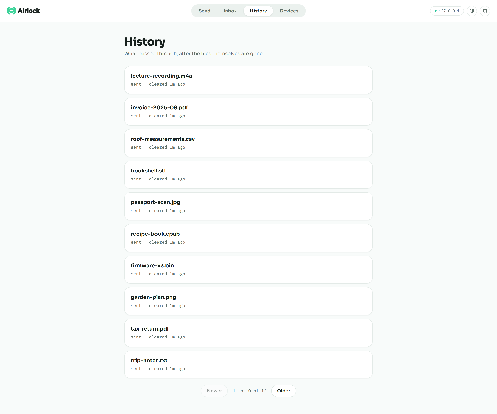
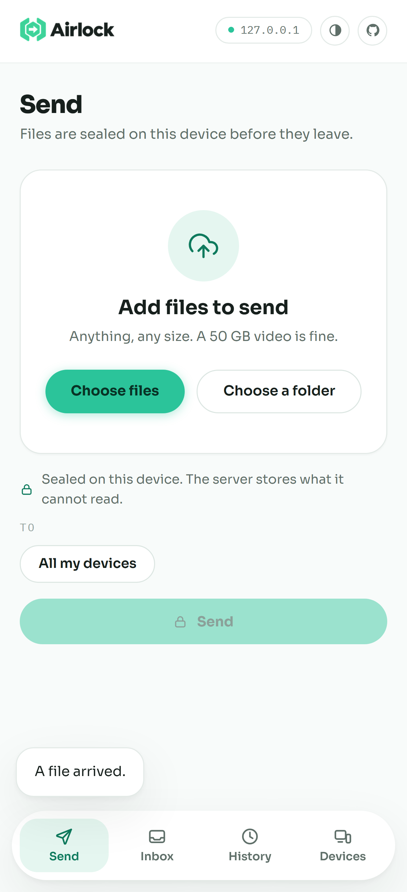
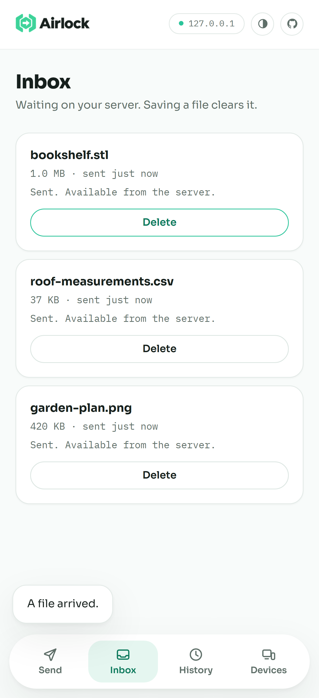
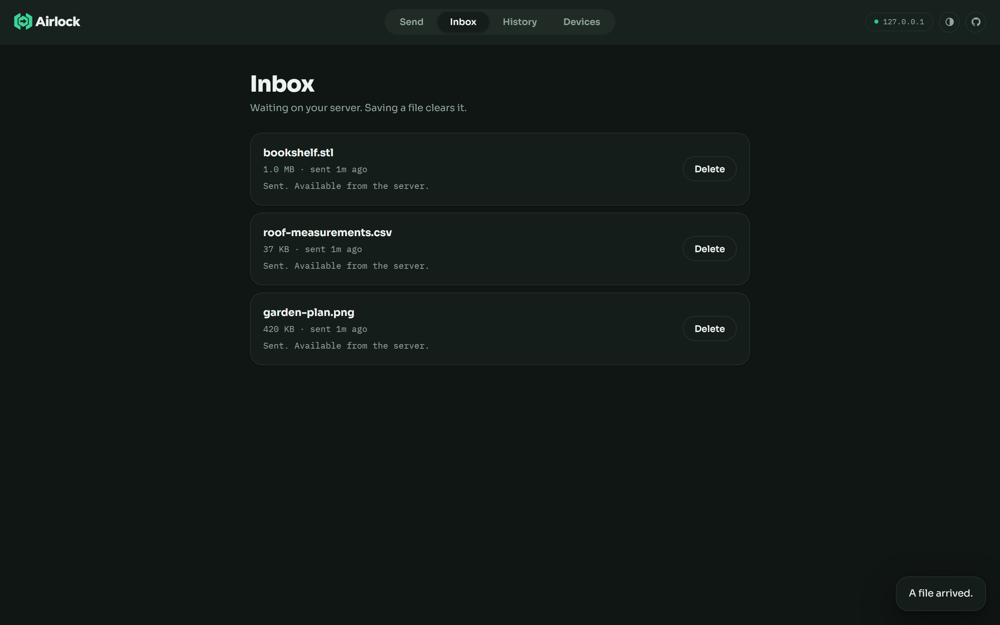

<a name="readme-top"></a>

<div align="center">

<picture>
  <source media="(prefers-color-scheme: dark)" srcset="./docs/assets/logo-dark.png">
  
</picture>

**Send files between your own devices. Encrypted before they leave.**

No accounts. No cloud. No size limit. No public port.

[![][license-shield]][license-link]
[![][go-shield]][go-link]
[![][tailscale-shield]][tailscale-link]
[![][crypto-shield]][crypto-link]
[![][client-shield]][client-link]

[Get started](#-get-started) · [Screenshots](#-screenshots) · [What it does](#-what-it-does) · [FAQ](#-faq) · [Security](#-security)

</div>

---

Airlock runs on one of your own machines and lets your phone, laptop and desktop
pass files to each other over [Tailscale](https://tailscale.com).

Your files are locked on the sending device before anything is uploaded. The
server holds only scrambled data. It never gets the key, so it cannot read your
files, their names, or even their thumbnails.

> \[!NOTE]
>
> Airlock works end to end today. It is a personal project, and [Status](#-status)
> is honest about which platforms have been tested on real hardware.

<div align="right">

[![][back-to-top]](#readme-top)

</div>

## ⚡ Get started

### Before you begin

You need two things. Both are free and take a few minutes.

- [ ] **[Tailscale](https://tailscale.com/download)** installed on at least two of your devices
- [ ] **HTTPS turned on** for your Tailscale network. One switch on the
      [DNS page](https://login.tailscale.com/admin/dns) of your admin console

<details>
<summary><kbd>Why does it need HTTPS?</kbd></summary>

<br/>

Browsers only allow encryption and offline features on a secure connection.
Without a real certificate, Airlock cannot lock your files in the browser at all.
Tailscale hands out certificates for free, and Airlock renews them for you.

</details>

### Three steps

**1. Get Airlock.** Download the file for your computer from
[Releases](https://github.com/ahnafnafee/airlock/releases).

<details>
<summary><kbd>Which file do I download?</kbd></summary>

<br/>

| Your computer | File |
| --- | --- |
| Windows | `airlock_..._windows_amd64.exe` |
| Mac (M1 or newer) | `airlock_..._darwin_arm64` |
| Mac (Intel) | `airlock_..._darwin_amd64` |
| Linux | `airlock_..._linux_amd64` |
| Raspberry Pi, ARM server | `airlock_..._linux_arm64` |

On Mac and Linux, make it runnable first:

```bash
chmod +x airlock_*
```

</details>

**2. Run it.** Double click it, or from a terminal:

```bash
./airlock
```

It prints one line. That line is your address:

```
open https://your-computer.your-network.ts.net/ on any device on your tailnet
```

**3. Open that address** on your phone, your laptop, anywhere on your Tailscale
network.

The first device picks a passphrase. Every other device enters the same one.
That passphrase is what unlocks your files, and it never leaves your devices.

**That's it.** Drop in a file, pick a device, press Send.

<details>
<summary><kbd>Install it as an app</kbd></summary>

<br/>

Airlock installs to your home screen or desktop like a normal app, and works
offline.

- **iPhone / iPad:** Share button, then **Add to Home Screen**
- **Android:** menu, then **Install app**
- **Windows / Mac desktop:** the install icon in the address bar (Chrome or Edge)

**On iPhone and iPad, install it before entering your passphrase.** A browser tab
and an installed app keep separate data, so a passphrase typed in the tab will not
be there in the app.

</details>

<details>
<summary><kbd>It says the port is in use</kbd></summary>

<br/>

Something else on that machine already uses port 443, often `tailscale serve`.
Pick another one:

```bash
./airlock --port 9443
```

The startup line will show the new address. Nothing else changes.

</details>

<details>
<summary><kbd>A device cannot find the server</kbd></summary>

<br/>

Almost always **Tailscale DNS** being switched off on that device.

- **Phone or tablet:** open the Tailscale app, Settings, turn on **Use Tailscale DNS**
- **Computer:** run `tailscale set --accept-dns=true`

Typing the numeric address instead will not work. Airlock's certificate is issued
for the name, so only the name connects.

If the name resolves but nothing loads, your Tailscale access rules may not allow
that device. Check the ACLs in your [admin console](https://login.tailscale.com/admin/acls).

</details>

<div align="right">

[![][back-to-top]](#readme-top)

</div>

## 📸 Screenshots

<div align="center">



<sub>**Send.** Drop files in, pick where they go, press one button. Nothing is
chosen for you: the destination is a decision you make each time.</sub>

<br/><br/>



<sub>**The chunk strip.** One segment per piece, at the width that piece really
occupies. Resend a file you edited and the parts that did not change are already
green, which is what deduplication looks like rather than a claim about it.</sub>

<br/><br/>



<sub>**Inbox.** What has arrived and is waiting. Saving a file clears it from the
list, and anything nobody collects clears itself.</sub>

<br/><br/>



<sub>**History.** What passed through, after the files themselves are gone.</sub>

<br/><br/>


&nbsp;&nbsp;


<sub>**On a phone**, installed to the home screen and working offline.</sub>

<br/><br/>



<sub>**Dark mode.** Airlock follows your system theme, and there is a switch in
the bar if you would rather it did not.</sub>

</div>

<div align="right">

[![][back-to-top]](#readme-top)

</div>

## 📦 What it does

| | |
| --- | --- |
| 📁 **Any size** | 50 GB video? Fine. Nothing is held in memory. |
| 🔒 **Private** | Locked on your device. The server stores what it cannot read. |
| ⚡ **Skips what it already has** | Send the same file twice and the second one is instant. |
| ✏️ **Sends only what changed** | Edit part of a big file, resend, and only that part uploads. |
| 🔁 **Survives a dropped connection** | Picks up where it stopped, not from zero. |
| 📬 **Waits for you** | Files sit on your server until a device collects them, then clear themselves. |
| 🔔 **Tells you** | A notification when something arrives, even with the app closed. |
| 📱 **Works everywhere** | Installs as an app on phone, tablet and desktop. |

### Why not just use...

| | |
| --- | --- |
| **Email** | Stops at 25 MB. |
| **Google Drive, Dropbox** | Uploads your file to a company that can read it. |
| **AirDrop** | Apple devices only, same room. |
| **A USB stick** | A walk across the room, and never with your phone. |
| **Taildrop** | Genuinely good, and simpler. It has no inbox, no history, and both devices must be awake. Reach for it first for a quick one-off. |

<div align="right">

[![][back-to-top]](#readme-top)

</div>

## ❓ FAQ

<details>
<summary><kbd>Can the server read my files?</kbd></summary>

<br/>

No. Your files are locked on the device sending them, before anything is
uploaded, using a key made from your passphrase. That key is never sent anywhere.

The server only ever holds scrambled data. Filenames, sizes and thumbnails are
locked too. This stays true even if the server is a rented VPS, and even if
somebody steals its hard drive.

</details>

<details>
<summary><kbd>What if I forget my passphrase?</kbd></summary>

<br/>

Your files cannot be recovered. There is no reset, because nobody holds a copy of
your key, including you after you have forgotten it. That is the trade for the
server never being able to read anything.

If it happens, delete Airlock's data folder and start again with a new
passphrase.

</details>

<details>
<summary><kbd>How long does a file wait to be collected?</kbd></summary>

<br/>

Ten minutes by default, then the server deletes it and the sender has to send it
again. The point is that your own machine is not a place files pile up: it holds
them only long enough to be picked up.

If your devices are not always to hand, give it longer:

```bash
./airlock --ttl-minutes 1440   # a day
```

A file that has been saved on a device leaves the queue immediately, without
waiting for the timer.

</details>

<details>
<summary><kbd>Do I need to buy a server?</kbd></summary>

<br/>

No. Any computer you already own works: a desktop, an old laptop, a Raspberry Pi.
It just needs to be switched on when you want to send something.

A rented server only helps if none of your machines are reliably awake.

</details>

<details>
<summary><kbd>Does it work on iPhone and Android?</kbd></summary>

<br/>

Yes, through the browser, and it installs to your home screen like an app.

For notifications while the app is closed, **Chrome is the more reliable choice on
Android**. Firefox on Android only receives notifications while Firefox itself is
running.

</details>

<details>
<summary><kbd>Is my file safe if someone breaks into the server?</kbd></summary>

<br/>

Your file contents are. An intruder gets scrambled data and cannot unlock any of
it without your passphrase, which never reached that machine.

They would see device names, file sizes and timestamps, and they could delete
things. Worth knowing.

</details>

<details>
<summary><kbd>Is it peer to peer?</kbd></summary>

<br/>

Not any more. There was a direct device-to-device mode and it was removed after
measuring it: it was about four times slower than going through the server, and
it needed both devices awake at the same moment.

Tailscale already connects your devices directly. Everything Airlock sends is
already locked before it leaves, so routing it through your own server costs
nothing in privacy and is faster and far more reliable.

</details>

<details>
<summary><kbd>Can other people on my Tailscale network see my files?</kbd></summary>

<br/>

They would need your passphrase to read anything. But on a shared network, lock
it down properly:

```bash
./airlock --allow-users you@example.com --require-approval
```

New devices then wait for approval from a device you have already approved.

</details>

<div align="right">

[![][back-to-top]](#readme-top)

</div>

## 🔒 Security

**Short version:** your files are encrypted on your device with a key made from
your passphrase. The server never sees that key.

| What | How |
| --- | --- |
| Not on the internet | Only reachable inside your Tailscale network |
| Only your devices | Tailscale proves who each device is |
| A lost phone | Revoke it instantly, no restart needed |
| The server, its disk, its backups | AES-256-GCM encryption |
| Filenames and thumbnails | Encrypted too, not plain text |
| Tampering | Every piece is verified before your file is rebuilt |

### What it does not protect against

- **Someone holding your unlocked phone.** They have your files.
- **A forgotten passphrase.** Nothing can recover it.
- **A server you do not control.** It still learns who sent how much, and when.

<details>
<summary><kbd>Technical detail</kbd></summary>

<br/>

Your passphrase becomes a key with PBKDF2-SHA256 at 600,000 iterations against a
per-server salt, held in your browser's origin-private storage and never
transmitted.

Files are split with content-defined chunking, so an edit does not shift every
later boundary, which is what makes resending a changed file cheap. Each piece
gets an id derived from its content and your key, so your own devices agree on
ids without anyone else being able to confirm a guess about the contents.

Pieces are encrypted with AES-256-GCM. Filenames, sizes and thumbnails travel as
separate encrypted records. Every piece is verified on the way back out, so a
substituted or corrupted one fails loudly instead of producing a plausible wrong
file.

</details>

<div align="right">

[![][back-to-top]](#readme-top)

</div>

## ⚙️ Options

Most people need none of these.

| Flag | Default | What it does |
| --- | --- | --- |
| `--port` | `443` | Use a different port |
| `--data` | system folder | Where files are stored |
| `--ttl-minutes` | `10` | How long an uncollected file waits before the server deletes it |
| `--require-approval` | off | New devices must be approved first |
| `--allow-users` | you | Which Tailscale accounts may connect |
| `--version` | | Print the version |

<details>
<summary><kbd>Keeping it running in the background</kbd></summary>

<br/>

**Linux (systemd).** Airlock needs permission to fetch its certificate:

```bash
sudo tailscale set --operator=$USER
```

```ini
# /etc/systemd/system/airlock.service
[Unit]
Description=Airlock
After=network-online.target tailscaled.service
Wants=network-online.target

[Service]
Type=simple
User=airlock
ExecStart=/usr/local/bin/airlock --data /var/lib/airlock
Restart=on-failure
RestartSec=5

[Install]
WantedBy=multi-user.target
```

```bash
sudo systemctl enable --now airlock
```

**Windows.** Create a scheduled task that runs at logon. Data is kept in
`%LOCALAPPDATA%\Airlock`.

Full instructions are in [Set up a server](./docs/deployment.md). For a rented
VPS with Docker, see [the detailed guide](./docs/deployment-advanced.md).

</details>

<div align="right">

[![][back-to-top]](#readme-top)

</div>

## 🗺 Status

**Working:** sending, receiving, notifications, saving, transfer history,
thumbnails, device approval, skipping data you already have, resending only what
changed, and resuming after a dropped connection.

**Tested on real devices:** Windows (Chrome, Edge, Firefox), Android (Chrome,
Firefox), iPad, and a two-device network.

**Not yet tested on hardware:** iPhone, macOS Safari, Linux desktop.

**Known limit:** closing the tab mid-transfer restarts from the last confirmed
piece rather than the exact byte.

<div align="right">

[![][back-to-top]](#readme-top)

</div>

## 🛠 For developers

<details>
<summary><kbd>Building and testing</kbd></summary>

<br/>

```bash
go test ./...              # server
node --test web/*.test.mjs # client, no dependencies to install
go build -o airlock .      # the client is embedded, so this is the whole build
```

The client is vanilla ES modules and plain CSS. **No build step, no bundler, no
package.json, no framework, no CDN.** Every CSS or JS edit needs `go build` to
take effect, because the client ships inside the binary.

CI runs the full suite on Linux, macOS and Windows for every push.

</details>

<details>
<summary><kbd>How a transfer works</kbd></summary>

<br/>

<p align="center">
  
</p>

<sub>Editable source: [`docs/assets/transfer-flow.excalidraw`](./docs/assets/transfer-flow.excalidraw), or [open it in Excalidraw](https://excalidraw.com/#json=pVlGLiJF1KEUIt47ga_yv,NEaE-6Wy31PnSi2BENSEnA).</sub>

1. The file is split into pieces along its own content, so an edit does not move
   every later boundary.
2. Each piece is fingerprinted using your key.
3. The server is asked which fingerprints it already has. That one question is
   what makes deduplication, partial resends and resuming all work.
4. Only the missing pieces are encrypted and uploaded.
5. The encrypted name, size and thumbnail land last, and that is what triggers
   the notification.

Full detail is in the [design spec](./docs/superpowers/specs/2026-08-15-airlock-design.md).

</details>

<details>
<summary><kbd>Measured performance</kbd></summary>

<br/>

| Phase | Throughput |
| --- | --- |
| Encryption | ~304 MB/s |
| Splitting | ~1.09 GB/s |
| Server storage | ~550 MB/s |
| Upload, end to end | 43 to 53 MB/s |
| Download, end to end | 66 to 109 MB/s |
| Rebuilding the file | ~104 MB/s |

Encryption is not the bottleneck, which is why there is no option to turn it off.
Numbers are from one desktop (i9-14900K); phone measurements are still open.
Method and caveats in [docs/benchmarks.md](./docs/benchmarks.md).

</details>

<div align="right">

[![][back-to-top]](#readme-top)

</div>

## 📄 License

[MIT](./LICENSE). Do what you like with it.

## 🔗 Links

- [Set up a server](./docs/deployment.md) - the short version, for a machine you own
- [Detailed deployment](./docs/deployment-advanced.md) - a rented VPS, Docker, day-two operations
- [Design spec](./docs/superpowers/specs/2026-08-15-airlock-design.md) - architecture and wire protocol
- [Benchmarks](./docs/benchmarks.md) - what was measured, and what is still open
- [Enabling Tailscale HTTPS](https://tailscale.com/kb/1153/enabling-https) - the one prerequisite
- [Taildrop][taildrop-link] - the simpler tool, already on your devices

<div align="right">

[![][back-to-top]](#readme-top)

</div>

<!-- LINK GROUP -->

[back-to-top]: https://img.shields.io/badge/-BACK_TO_TOP-151515?style=flat-square
[client-link]: https://developer.mozilla.org/en-US/docs/Web/Progressive_web_apps
[client-shield]: https://img.shields.io/badge/client-PWA-8A9A93?labelColor=black&style=flat-square
[crypto-link]: #-security
[crypto-shield]: https://img.shields.io/badge/encryption-AES--256--GCM-4FD1A5?labelColor=black&style=flat-square
[go-link]: https://go.dev
[go-shield]: https://img.shields.io/badge/go-1.26-00ADD8?labelColor=black&logo=go&logoColor=white&style=flat-square
[license-link]: ./LICENSE
[license-shield]: https://img.shields.io/badge/license-MIT-4FD1A5?labelColor=black&style=flat-square
[taildrop-link]: https://tailscale.com/kb/1106/taildrop
[tailscale-link]: https://tailscale.com/kb/1244/tsnet
[tailscale-shield]: https://img.shields.io/badge/network-Tailscale-242424?labelColor=black&logo=tailscale&logoColor=white&style=flat-square
