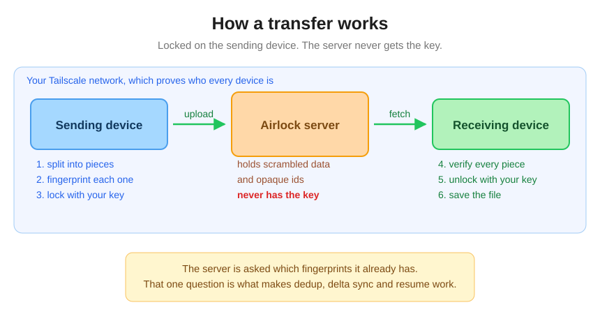

# Set up a server

Airlock needs one machine that stays on. Files pass through it on their way
between your devices, so it should be something that is usually awake: a
desktop, an old laptop, a home server, a Raspberry Pi.

This page is the short version and covers what most people need.
Renting a VPS, running in Docker, and the operational detail that goes with a
machine you cannot walk over to are in
[the detailed guide](./deployment-advanced.md).

<p align="center">
  
</p>

---

## Before you start

- [ ] **[Tailscale](https://tailscale.com/download)** on the server machine and on at least one other device
- [ ] **HTTPS enabled** for your network: one switch on the
      [DNS page](https://login.tailscale.com/admin/dns) of the Tailscale admin console

That second one is not optional. Browsers only allow encryption on a secure
connection, so without a certificate Airlock cannot lock your files at all.
Tailscale issues them free and Airlock renews them for you.

## Step 1: put Airlock on the machine

Download the file for that machine from
[Releases](https://github.com/ahnafnafee/airlock/releases).

On Mac or Linux, make it runnable:

```bash
chmod +x airlock_*
```

## Step 2: run it

```bash
./airlock
```

It prints one line, and that line is your address:

```
open https://your-machine.your-network.ts.net/ on any device on your tailnet
```

If it says the port is in use, something else has 443, often `tailscale serve`.
Pick another:

```bash
./airlock --port 9443
```

## Step 3: open that address on your devices

On each device, open the address, and **use the name, not the numeric address**.
The certificate is issued for the name, so only the name connects.

The first device you open it on picks a passphrase. Every other device enters
the same one. That passphrase is what locks and unlocks your files, and it never
leaves your devices.

Then install it as an app: **Add to Home Screen** on a phone, or the install
icon in the address bar on a desktop.

> On iPhone and iPad, install it **before** entering the passphrase. A browser
> tab and an installed app keep separate storage, so a passphrase typed in the
> tab will not be there in the app.

That is the whole setup.

---

## Keeping it running

Airlock stops when you close the terminal. To keep it up:

<details>
<summary><kbd>Linux</kbd></summary>

<br/>

Give it permission to fetch its certificate:

```bash
sudo tailscale set --operator=$USER
```

Then create `/etc/systemd/system/airlock.service`:

```ini
[Unit]
Description=Airlock
After=network-online.target tailscaled.service
Wants=network-online.target

[Service]
Type=simple
User=airlock
ExecStart=/usr/local/bin/airlock --data /var/lib/airlock
Restart=on-failure
RestartSec=5

[Install]
WantedBy=multi-user.target
```

```bash
sudo systemctl enable --now airlock
```

</details>

<details>
<summary><kbd>Windows</kbd></summary>

<br/>

Create a scheduled task that runs at logon, pointing at `airlock.exe`. Data is
kept in `%LOCALAPPDATA%\Airlock`.

</details>

<details>
<summary><kbd>Mac</kbd></summary>

<br/>

A `launchd` agent in `~/Library/LaunchAgents/`, or just leave it running in a
terminal tab if the machine is your desktop.

</details>

## Settings worth knowing

Most people change none of these.

| Flag | Default | What it does |
| --- | --- | --- |
| `--port` | `443` | Use a different port |
| `--ttl-minutes` | `10` | How long an uncollected file waits before the server deletes it |
| `--require-approval` | off | New devices must be approved from a device you already trust |
| `--allow-users` | you | Which Tailscale accounts may connect |
| `--data` | system folder | Where files are stored |

**On a shared Tailscale network**, turn both safeguards on:

```bash
./airlock --allow-users you@example.com --require-approval
```

## When something is wrong

<details>
<summary><kbd>A device says the server cannot be found</kbd></summary>

<br/>

Almost always **Tailscale DNS** switched off on that device.

- **Phone or tablet:** Tailscale app, Settings, turn on **Use Tailscale DNS**
- **Computer:** `tailscale set --accept-dns=true`

Using the numeric address instead will not work. The certificate is for the
name.

</details>

<details>
<summary><kbd>The name resolves but nothing loads</kbd></summary>

<br/>

Your Tailscale access rules may not let that device reach the server. Check the
ACLs in your [admin console](https://login.tailscale.com/admin/acls), and make
sure the device is listed as a source for the port Airlock is on.

</details>

<details>
<summary><kbd>A file vanished before anyone collected it</kbd></summary>

<br/>

That is the ten minute expiry doing its job. Give it longer if your devices are
not always to hand:

```bash
./airlock --ttl-minutes 1440   # a day
```

</details>

<details>
<summary><kbd>Notifications never arrive</kbd></summary>

<br/>

Open the Inbox. If notifications are off or blocked for the site, it says so
there and tells you what to do.

On Android, **Chrome is the more reliable choice**: it receives notifications
through a system service that keeps working when the browser is closed. Firefox
on Android only receives them while Firefox itself is running.

</details>

## Backing it up

There is nothing to back up. Files pass through and are deleted once collected
or once they expire, and the server cannot read them anyway. Losing the data
directory costs you any transfer that has not been collected yet and the list of
which devices you approved.

If you wipe it, every device re-enters the same passphrase and carries on.
